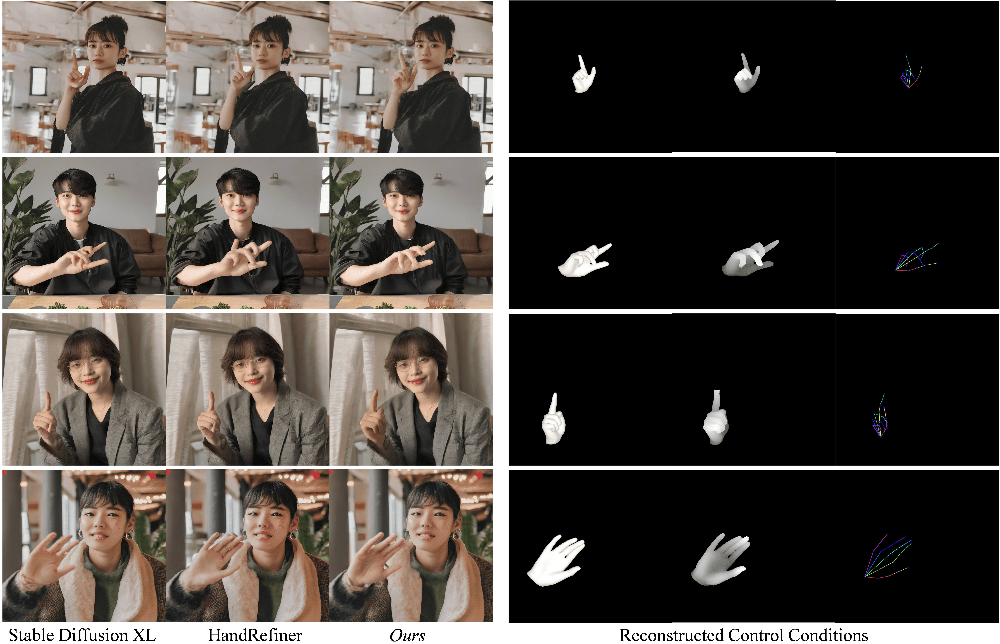

# Mixture-of-Hand-Experts
coc# MoHE: Mixture of Hand Experts
Code repository for the paper:
**Mixture of Hand Experts: Repaint the Deformed Hands in Generated Image**

## Installation
First you need to clone the repo:
```
git clone https://github.com/PRIS-CV/Mixture-of-Hand-Experts.git
cd Mixture-of-Hand-Experts
```
We recommend creating a virtual environment:
```bash
conda create --name MoHE python=3.10
conda activate MoHE
```
Install the rest of the dependencies
```bash
pip install -r requirments.txt
cd Hamer
pip install -e .[all]
pip install -v -e third-party/ViTPose
```
## Get Started
First you should put your models as follow:
```
--models
   --base_model #sd base model
   --controlnets #finetuned controlnets (mesh,depth,pose)
   --gate_network #applied in MoE module
   --hamer #models for extracting control conditions
   --vae #vae model
   --yolo #hand detector
```
Then run the following command for inference:
```bash
python MoHE_test.py \
    --base_model 'models/base_model' --vae 'models/vae' --controlnet_mesh 'models/controlnets' \
    --controlnet_pose 'models/controlnets' --controlnet_depth 'models/controlnets' --condition_extractor 'models/hamer' \
    --hand_detector 'models/yolo' --gate_network 'models/gate_network' --meta_json 'metadata.json' --seed 42 \
    --output output
```
## Training
```
cd training
```
### Training & Finetuning ControlNet:
First you should prepare your training dataset in following form:
```
--dataset
      --conditioning_images #control conditions(depth, mesh, pose)
      --images #ground truth
      dataset.py # prepare for training
      train.jsonl #infomation for training dataset {"text": prompt, "image": "images/00000.png", "conditioning_image": "conditioning_images/00000.png"}
```
Then run the following command to train or finetune ControlNet:
```bash
 CUDA_VISIBLE_DEVICES=0 python train_controlnet_sdxl.py \
 --pretrained_model_name_or_path ""\
 --output_dir "" \
 --controlnet_model_name_or_path ""\
 --pretrained_vae_model_name_or_path ""\
 --dataset_name  ''\
 --mixed_precision="fp16" \
 --resolution=1024 \
 --learning_rate=1e-5 \
 --max_train_steps=15000 \
 --validation_image "" \
 --validation_prompt "" \
 --validation_steps=100 \
 --train_batch_size=1 \
 --gradient_accumulation_steps=4 \
 --report_to="wandb" \
 --seed=42
```
### Training gating network:
First you should prepare ground truth (real images) and extract the control condtions from them using hamer detector. Then applying the extracted control conditions to the sd pipeline to obtain the corresponding generated images
```bash
python MoHE_train.py \
    --base_model 'models/base_model' --vae 'models/vae' --controlnet_mesh 'models/controlnets' \
    --controlnet_pose 'models/controlnets' --controlnet_depth 'models/controlnets' --condition_extractor 'models/hamer' \
    --meta_json 'metadata.json' --seed 42 --epoch 100 --lr 0.001 --generate 'path for generated images by controlnet' \
    -- ground_truth 'path for ground_truth images'--output output
```